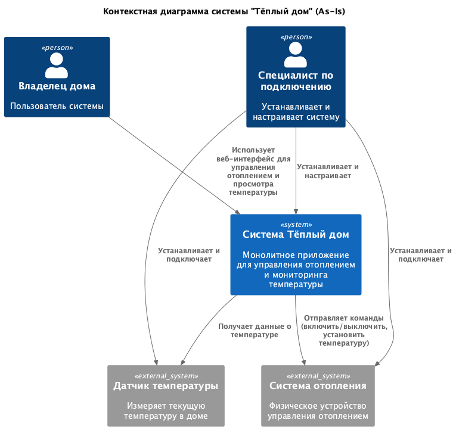
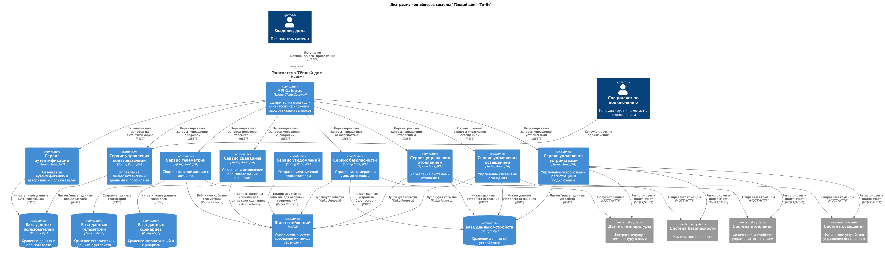
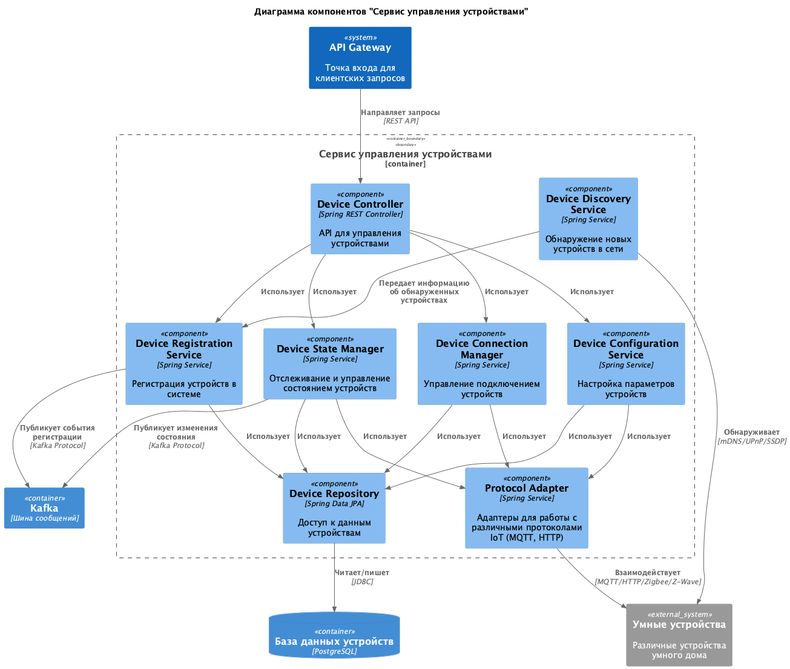
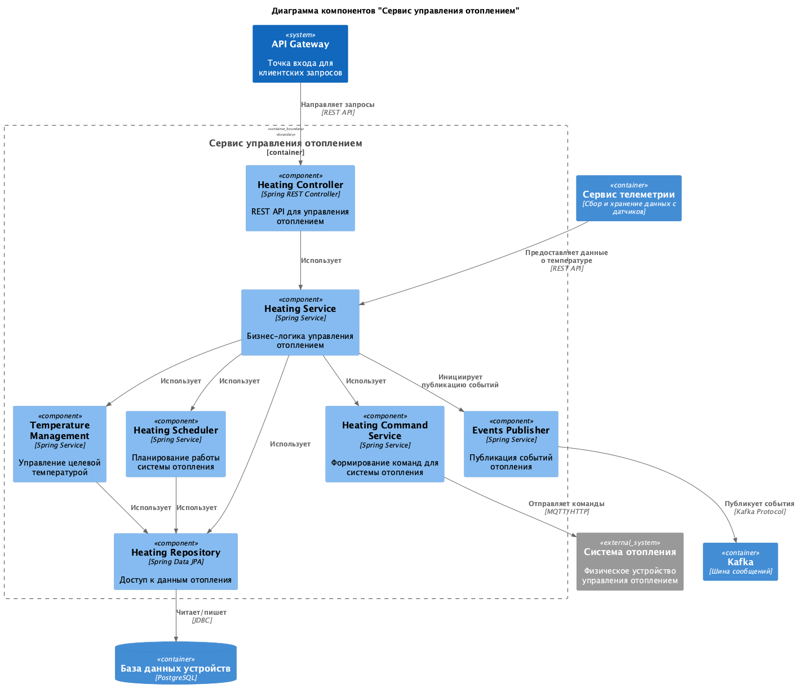
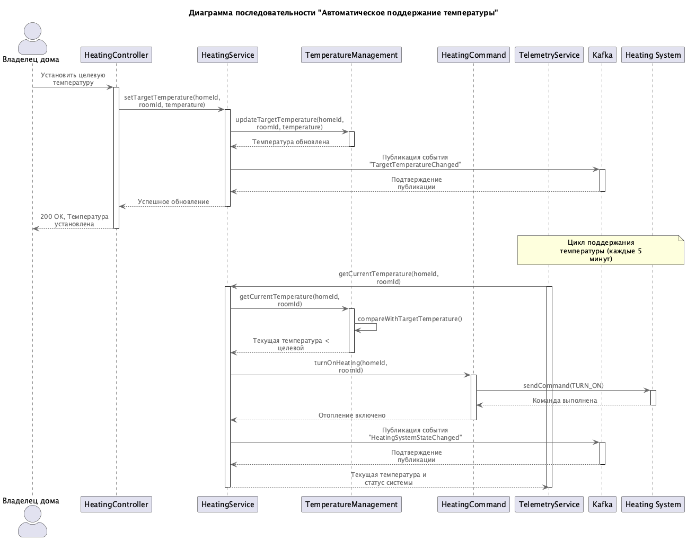
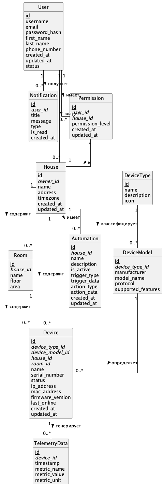

# Задание 1. Анализ и планирование

### 1. Описание функциональности монолитного приложения

**Управление отоплением:**

- Пользователи могут удаленно включать и выключать отопление в своих домах 
- Пользователи могут устанавливать целевую температуру для системы отопления
- Система позволяет получать информацию о текущем состоянии системы отопления (включена/выключена)
- Система поддерживает изменение параметров отопления через HTTP-запросы

**Мониторинг температуры:**

- Пользователи могут просматривать текущую температуру в своих домах
- Система получает данные с температурных датчиков, установленных в домах
- Система сохраняет историю изменений температуры с временными метками
- Доступ к данным о температуре осуществляется через веб-интерфейс

### 2. Анализ архитектуры монолитного приложения

- **Язык программирования**: Java (версия 17) с использованием Spring Boot
- **База данных**: PostgreSQL - единая для всех компонентов системы
- **Архитектура**: Монолитная - все компоненты (контроллеры, сервисы, репозитории) находятся в рамках одного приложения
- **Взаимодействие**: Синхронное - все запросы обрабатываются последовательно через REST API
- **Структура кода**: Стандартные слои Spring приложения (контроллеры, сервисы, репозитории, сущности)
- **Контейнеризация**: Приложение упаковано в Docker-контейнер
- **Развертывание**: Монолитное - требует остановки всего приложения для обновления любой части
- **Масштабируемость**: Ограниченная - возможно только горизонтальное масштабирование всего приложения целиком

### 3. Определение доменов и границы контекстов

В текущем монолитном приложении можно выделить следующие домены:

1. **Домен управления отоплением**:
   - Управление состоянием системы отопления (включение/выключение)
   - Установка целевой температуры
   - Поддержание заданной температуры

2. **Домен мониторинга температуры**:
   - Сбор данных с температурных датчиков
   - Хранение истории показаний
   - Предоставление текущих показаний

3. **Домен аутентификации и авторизации** (неявно присутствует):
   - Идентификация пользователей
   - Контроль доступа к управлению отоплением

4. **Домен управления устройствами** (имплицитно):
   - Регистрация и подключение датчиков
   - Управление состоянием датчиков

### **4. Проблемы монолитного решения**

- **Ограничения масштабируемости**: Невозможно масштабировать отдельные компоненты системы в зависимости от нагрузки. При росте числа пользователей и устройств потребуется существенное увеличение ресурсов для всего монолита.
- **Проблемы устойчивости и отказоустойчивости**: Сбой в одной части системы может привести к отказу всего приложения. Обновление любого компонента требует остановки всей системы.
- **Ограничения развития продукта**: Сложность добавления новых типов устройств (освещение, видеонаблюдение, ворота). Отсутствие возможности самостоятельного подключения пользователями новых устройств.
- **Технологические ограничения**: Вся система должна использовать одни и те же технологии (Java + Spring). Отсутствие асинхронного взаимодействия с устройствами снижает реактивность системы.
- **Бизнес-ограничения**: Сложность интеграции с устройствами партнеров из-за монолитности архитектуры. Увеличение времени выхода новых функций на рынок.
- **Проблемы модели распространения**: Невозможность реализации SaaS-модели с самообслуживанием. Каждая установка требует выезда специалиста.

### 5. Визуализация контекста системы — диаграмма С4

[Исходный код диаграммы](diagrams/puml/context.puml)

# Задание 2. Проектирование микросервисной архитектуры

**Диаграмма контейнеров (Containers)**

[Исходный код диаграммы](diagrams/puml/containers.puml)

**Диаграмма компонентов (Components) для сервиса управления устройствами**

[Исходный код диаграммы](diagrams/puml/device_service.puml)

**Диаграмма компонентов (Components) для сервиса управления отоплением**

[Исходный код диаграммы](diagrams/puml/heating_service.puml)

**Диаграмма кода (Code) для критичной части управления отоплением**

[Исходный код диаграммы](diagrams/puml/heating_sequence.puml)

# Задание 3. Разработка ER-диаграммы

## Идентификация сущностей

На основе анализа предметной области и спроектированной микросервисной архитектуры системы "Тёплый дом", я определил следующие ключевые сущности:

1. **User (Пользователь)** - пользователи системы
2. **House (Дом)** - физические дома, подключенные к системе
3. **Room (Комната)** - комнаты в домах для уточнения расположения устройств
4. **Device (Устройство)** - физические устройства умного дома
5. **DeviceType (Тип устройства)** - категории устройств (отопление, освещение и т.д.)
6. **DeviceModel (Модель устройства)** - конкретные модели устройств от производителей
7. **TelemetryData (Данные телеметрии)** - исторические данные, собираемые с устройств
8. **Automation (Сценарий автоматизации)** - пользовательские сценарии и автоматизации
9. **Notification (Уведомление)** - оповещения пользователей
10. **Permission (Разрешение)** - права доступа к домам

## Атрибуты сущностей

### User (Пользователь)
- id (PK) - уникальный идентификатор пользователя
- username - логин пользователя
- email - электронная почта
- password_hash - хэш пароля
- first_name - имя
- last_name - фамилия
- phone_number - номер телефона
- created_at - дата создания
- updated_at - дата обновления
- status - статус (активен/неактивен)

### House (Дом)
- id (PK) - уникальный идентификатор дома
- owner_id (FK -> User) - идентификатор владельца
- name - наименование дома
- address - физический адрес
- timezone - часовой пояс
- created_at - дата создания
- updated_at - дата обновления

### Room (Комната)
- id (PK) - уникальный идентификатор комнаты
- house_id (FK -> House) - идентификатор дома
- name - наименование комнаты
- floor - этаж
- area - площадь

### Device (Устройство)
- id (PK) - уникальный идентификатор устройства
- device_type_id (FK -> DeviceType) - идентификатор типа устройства
- device_model_id (FK -> DeviceModel) - идентификатор модели устройства
- house_id (FK -> House) - идентификатор дома
- room_id (FK -> Room, nullable) - идентификатор комнаты
- name - пользовательское имя устройства
- serial_number - серийный номер
- status - текущее состояние (вкл/выкл/ошибка)
- ip_address - IP-адрес
- mac_address - MAC-адрес
- firmware_version - версия прошивки
- last_online - время последнего подключения
- created_at - дата создания
- updated_at - дата обновления

### DeviceType (Тип устройства)
- id (PK) - уникальный идентификатор типа устройства
- name - название (отопление, освещение, безопасность и т.д.)
- description - описание
- icon - иконка для интерфейса

### DeviceModel (Модель устройства)
- id (PK) - уникальный идентификатор модели
- device_type_id (FK -> DeviceType) - идентификатор типа устройства
- manufacturer - производитель
- model_name - название модели
- protocol - протокол (MQTT, HTTP, Zigbee и т.д.)
- supported_features - поддерживаемые функции (JSON)

### TelemetryData (Данные телеметрии)
- id (PK) - уникальный идентификатор записи
- device_id (FK -> Device) - идентификатор устройства
- timestamp - время измерения
- metric_name - название метрики (температура, потребление и т.д.)
- metric_value - значение метрики
- metric_unit - единица измерения (°C, кВтч и т.д.)

### Automation (Сценарий автоматизации)
- id (PK) - уникальный идентификатор сценария
- house_id (FK -> House) - идентификатор дома
- name - название сценария
- description - описание
- is_active - активен ли сценарий
- trigger_type - тип триггера (расписание, состояние устройства и т.д.)
- trigger_data - данные триггера (JSON)
- action_type - тип действия
- action_data - данные действия (JSON)
- created_at - дата создания
- updated_at - дата обновления

### Notification (Уведомление)
- id (PK) - уникальный идентификатор уведомления
- user_id (FK -> User) - идентификатор пользователя
- title - заголовок
- message - текст сообщения
- type - тип (информация, предупреждение, ошибка)
- is_read - прочитано ли
- created_at - дата создания

### Permission (Разрешение)
- id (PK) - уникальный идентификатор разрешения
- user_id (FK -> User) - идентификатор пользователя
- house_id (FK -> House) - идентификатор дома
- permission_level - уровень доступа (владелец, администратор, пользователь, гость)
- created_at - дата создания
- updated_at - дата обновления

## Связи между сущностями

1. **User - House**: One-to-Many (один пользователь может владеть несколькими домами)
2. **User - Permission - House**: Many-to-Many через таблицу Permission (многие пользователи могут иметь доступ к многим домам)
3. **House - Room**: One-to-Many (один дом содержит много комнат)
4. **House - Device**: One-to-Many (один дом содержит много устройств)
5. **Room - Device**: One-to-Many (одна комната содержит много устройств)
6. **DeviceType - DeviceModel**: One-to-Many (один тип устройства может иметь много моделей)
7. **DeviceModel - Device**: One-to-Many (одна модель может быть у многих устройств)
8. **Device - TelemetryData**: One-to-Many (одно устройство генерирует много записей телеметрии)
9. **House - Automation**: One-to-Many (в одном доме может быть множество сценариев)
10. **User - Notification**: One-to-Many (один пользователь может получать множество уведомлений)

## ER-диаграмма

[Исходный код диаграммы](diagrams/puml/er_diagram.puml)

Данная ER-диаграмма отражает структуру базы данных системы "Тёплый дом", идентифицируя ключевые сущности, их атрибуты и взаимосвязи. Диаграмма спроектирована с учетом требований микросервисной архитектуры, где каждый микросервис может иметь доступ к определенной части общей модели данных, соответствующей его ответственности.

Четвёртое задание — дополнительное. Его можно сделать по желанию. Чтобы ревьюер быстрее проверил ваше решение, укажите, сделали вы это задание или нет. Для этого оставьте нужный эмодзи около заголовка задания:

✅ — вы выполнили задание.

❌ — вы пропустили задание.

# ✅ Задание 4. Создание и документирование API

### 1. Тип API

Для реализации взаимодействия между микросервисами в системе "Тёплый дом" я выбрал комбинированный подход, использующий два типа API:

1. **REST API** для синхронного взаимодействия между:
   - API Gateway и микросервисами
   - Микросервисами, когда требуется немедленный ответ
   - Клиентскими приложениями и бэкенд-системой

2. **AsyncAPI (Kafka)** для асинхронного обмена событиями между микросервисами, когда:
   - Необходимо уведомить о изменении состояния устройства
   - Требуется передавать телеметрические данные
   - Запускаются автоматизированные сценарии
   - Генерируются уведомления для пользователей

Такой подход обеспечивает баланс между предсказуемостью синхронных вызовов и масштабируемостью событийно-ориентированной архитектуры, позволяя системе эффективно обрабатывать как запросы, требующие немедленного ответа, так и асинхронные события с высоким объемом данных.

### 2. Документация API

#### REST API для микросервиса "Управление устройствами"

Спецификация API доступна:
- В репозитории: [api-specs/device-management-api.yaml](api-specs/device-management-api.yaml)
- На SwaggerHub: [Device Management Service API](https://app.swaggerhub.com/apis/alexg-1b5/device-management_service_api/1.0.0)

#### REST API для микросервиса "Управление отоплением"

Спецификация API доступна:
- В репозитории: [api-specs/heating-control-api.yaml](api-specs/heating-control-api.yaml)
- На SwaggerHub: [Heating Control Service API](https://app.swaggerhub.com/apis/alexg-1b5/heating-control_service_api/1.0.0)

#### AsyncAPI для событий устройств через Kafka

Спецификация API доступна:
- В репозитории: [api-specs/device-events-asyncapi.yaml](api-specs/device-events-asyncapi.yaml)
- На SwaggerHub: [Smart Home Device Events API](https://app.swaggerhub.com/apis/alexg-1b5/smart-home_device_events_api/1.0.0)

### 3. Заключение по выбору API

Представленные API документы охватывают основные взаимодействия в системе "Тёплый дом", включая:

1. **REST API для сервиса управления устройствами** - позволяет регистрировать, получать информацию и отправлять команды устройствам

2. **REST API для сервиса управления отоплением** - специализированный API для управления температурным режимом и состоянием систем отопления

3. **AsyncAPI для событийной коммуникации через Kafka** - обеспечивает асинхронный обмен данными между микросервисами для телеметрии, изменений состояния устройств и сценариев автоматизации

Эти API интерфейсы обеспечивают полноценную интеграцию микросервисов в единую экосистему, позволяя им эффективно обмениваться информацией как в синхронном, так и в асинхронном режиме.