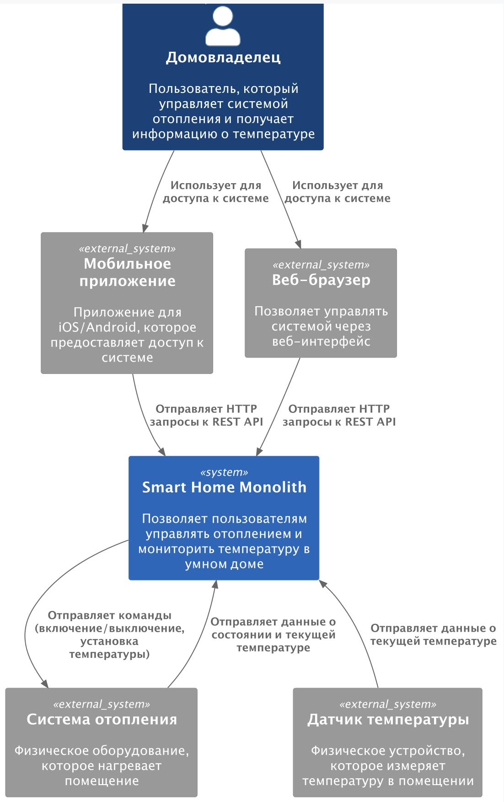

# Project_template

Это шаблон для решения проектной работы. Структура этого файла повторяет структуру заданий. Заполняйте его по мере работы над решением.

# Задание 1. Анализ и планирование

<aside>
💡

Чтобы составить документ с описанием текущей архитектуры приложения, можно часть информации взять из описания компани и условия задания. Это нормально.

</aside>

### 1. Описание функциональности монолитного приложения

**Управление отоплением:**

- Пользователи могут удаленно включать и выключать системы отопления через веб-интерфейс
- Пользователи могут устанавливать желаемую (целевую) температуру для системы отопления
- Система позволяет получать информацию о текущем состоянии нагревательной системы (включена/выключена)
- Система позволяет отслеживать текущую и целевую температуру для нагревательных систем
- Система предоставляет REST API для интеграции с другими системами умного дома

**Мониторинг температуры:**

- Пользователи могут просматривать текущие показания температуры от датчиков
- Система отслеживает и хранит данные о показаниях температуры с отметками времени
- Пользователи могут получать данные о последнем обновлении датчиков температуры
- Система предоставляет API для получения текущих и исторических данных о температуре

### 2. Анализ архитектуры монолитного приложения

Перечислите здесь основные особенности текущего приложения: какой язык программирования используется, какая база данных, как организовано взаимодействие между компонентами и так далее.
- Язык программирования: Java
- База данных: PostgreSQL
- Архитектура: Монолитная, все компоненты системы (обработка запросов, бизнес-логика, работа с данными) находятся в рамках одного приложения.
- Взаимодействие: Синхронное, запросы обрабатываются последовательно.
- Масштабируемость: Ограничена, так как монолит сложно масштабировать по частям.
- Развёртывание: Требует остановки всего приложения.
### 3. Определение доменов и границы контекстов

Опишите здесь домены, которые вы выделили.

1. Домен "Управление отоплением" (Heating Management)
   Этот домен отвечает за функциональность, связанную с системами отопления:
- Управление состоянием нагревательных систем (включение/выключение)
- Настройка и отслеживание целевой температуры
- Автоматическое поддержание заданной температуры
- Сохранение состояния и конфигурации нагревательных систем

2. Домен "Мониторинг температуры" (Temperature Monitoring)
   Этот домен отвечает за сбор, хранение и предоставление данных о температуре:

- Считывание и сохранение показаний температурных датчиков
- Отслеживание времени последнего обновления данных
- Предоставление исторических данных о температуре (не реализовано)
- Аналитика и обработка температурных данных(не реализовано)

3. В том или ином виде должно быть управление пользователями и разграничение доступа, но оно опять же отсутствует в проекте

4. Работа с подключенными устройствами - в зачаточном виде - сейчас это только датчики температуры, сейчас не видно обрабоки событий и возможностей пользовательской автоматизации

### **4. Проблемы монолитного решения**

1. Отсутствует логирование
2. Отсутствие гибкости в подключении устройств: Необходимость выезда специалистов для установки устройств тормозит расширение экосистемы.
3. Неудобства масштабирования - при увеличении числа устройств я бы ожидал гораздо большую нагрузку на часть системы обрабатывающую события устройств => хорошо бы иметь возможность масштабировать её отдельно
4. Архитектурные проблемы:
    - Нечеткие границы между доменами (например, перекрытие функциональности в работе с температурой)
    - Отсутствие полной реализации некоторых доменов (мониторинг температуры реализован частично)
    - Избыточность данных (currentTemperature хранится и в HeatingSystem, и в TemperatureSensor)
    - currentTemperature - непонятно зачем вообще в базе хранить и зачем она на входе в updateHeatingSystem

### 5. Визуализация контекста системы — диаграмма С4

[Диаграмма](diagrams/puml/c4_context_as_is.puml)

# Задание 2. Проектирование микросервисной архитектуры

В этом задании вам нужно предоставить только диаграммы в модели C4. Мы не просим вас отдельно описывать получившиеся микросервисы и то, как вы определили взаимодействия между компонентами To-Be системы. Если вы правильно подготовите диаграммы C4, они и так это покажут.

**Диаграмма контейнеров (Containers)**

Добавьте диаграмму.

**Диаграмма компонентов (Components)**

Добавьте диаграмму для каждого из выделенных микросервисов.

**Диаграмма кода (Code)**

Добавьте одну диаграмму или несколько.

# Задание 3. Разработка ER-диаграммы

Добавьте сюда ER-диаграмму. Она должна отражать ключевые сущности системы, их атрибуты и тип связей между ними.

Четвёртое задание — дополнительное. Его можно сделать по желанию. Чтобы ревьюер быстрее проверил ваше решение, укажите, сделали вы это задание или нет. Для этого оставьте нужный эмодзи около заголовка задания:

✅ — вы выполнили задание.

❌ — вы пропустили задание.

# ✅ ❌ Задание 4. Создание и документирование API

### 1. Тип API

Укажите, какой тип API вы будете использовать для взаимодействия микросервисов. Объясните своё решение.

### 2. Документация API

Здесь приложите ссылки на документацию API для микросервисов, которые вы спроектировали в первой части проектной работы. Для документирования используйте Swagger/OpenAPI или AsyncAPI.